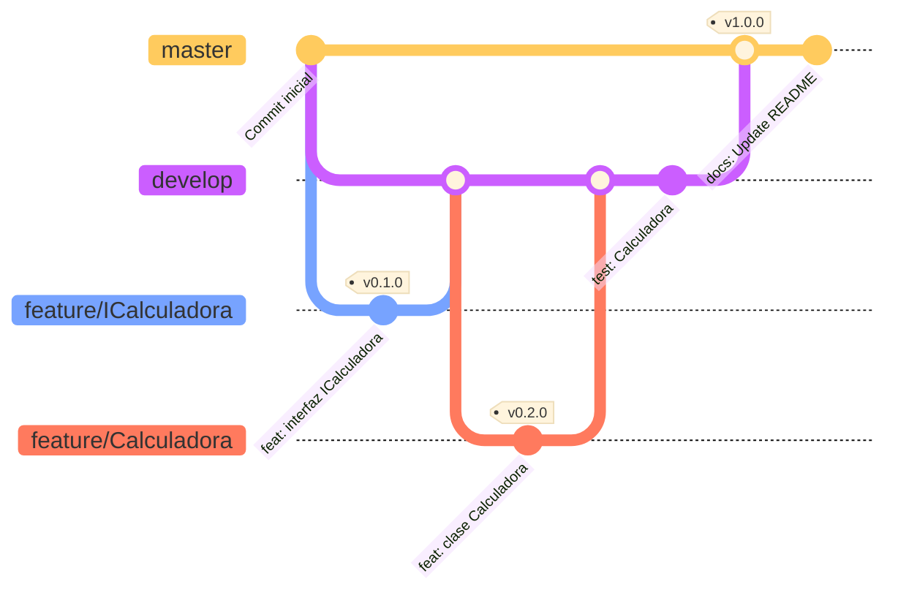

# prueba_mermaid

```mermaid
%%{init: { 'logLevel': 'debug', 'theme': 'base', 'gitGraph': {'showBranches': true, 'showCommitLabel':true,'mainBranchName': 'master'}} }%%
gitGraph
  commit id:"Commit inicial"
  branch develop
  branch feature/ICalculadora
  commit id:"feat: interfaz ICalculadora" tag:"v0.1.0"
  checkout develop
  merge feature/ICalculadora
  branch feature/Calculadora
  commit id:"feat: clase Calculadora" tag:"v0.2.0"
  checkout develop
  merge feature/Calculadora
  commit id:"test: Calculadora"
  checkout master
  merge develop tag:"v1.0.0"
  commit id:"docs: Update README"
```
